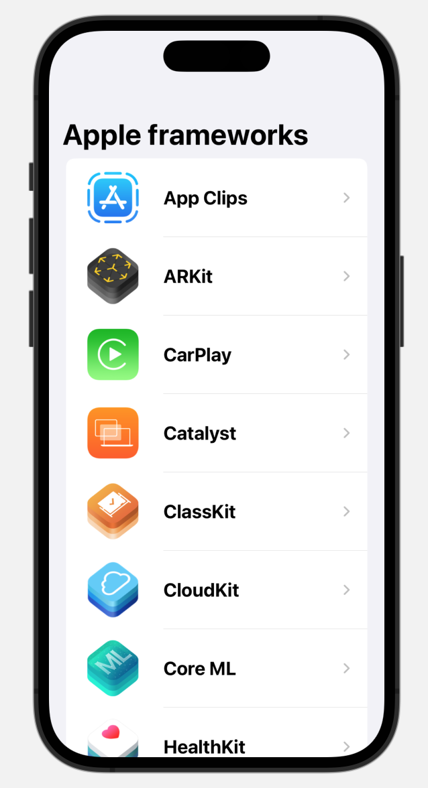
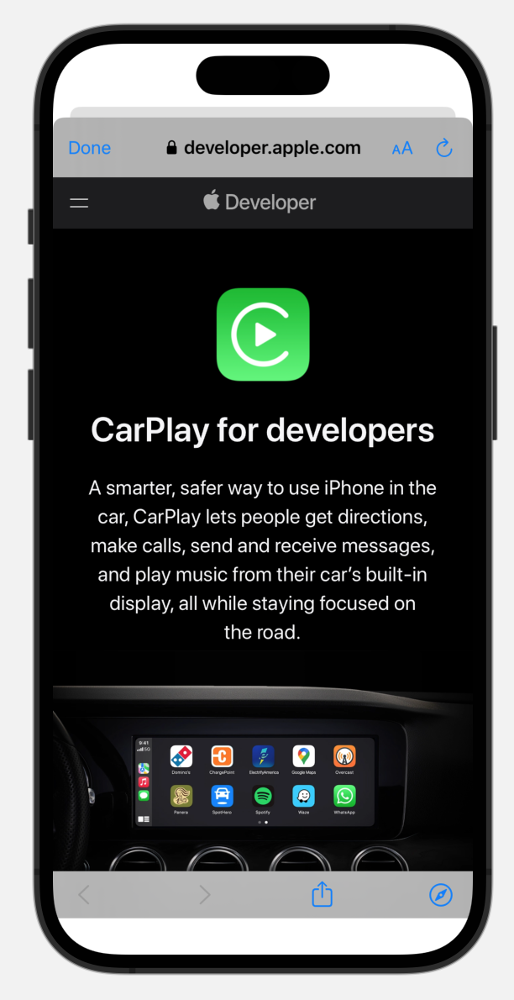

# Apple frameworks

## Introduction
This is my second SwiftUI project. Here I'm learning to develope and manage different views.

The project consists in developing an app that shows the list of the main Apple's frameworks and their detailes.

I'm studying SwiftUI thanks to this [video.](https://youtu.be/b1oC7sLIgpI?si=rbQqJavLBTJpxdya)

## Previews

